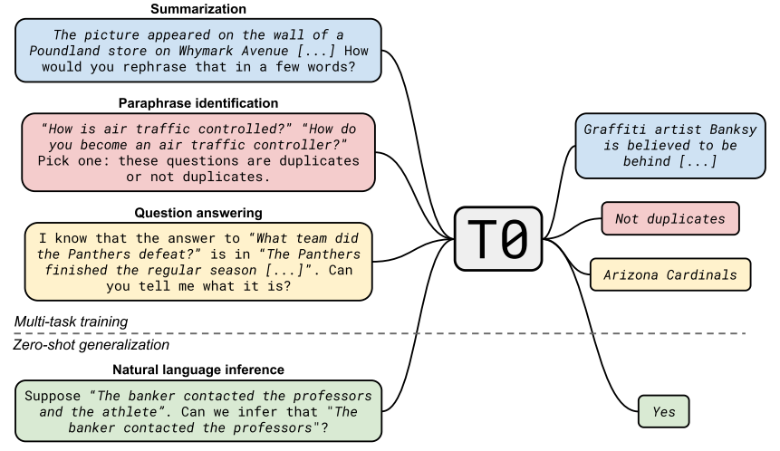

> v1: updated at 2022/04/19
>
> v2: updated at 2022/05/05

#### 1、比赛简介

本次比赛以多任务小样本为题目，以保险、金融、医疗领域为背景，探索如何以统一模型的方式在数据资源受限的场景下提升模型的泛化迁移能力。比赛要求最终模型为可以实现完整测试的单独模型。

#### 2、数据简介

```bash
.
└── data
    ├── opensource_sample_500.json
    ├── test_data_A.json
    └── train_data.json
```

遵循小样本学习的任务特点，本次比赛数据分为训练集和测试集两部分（`train_data.json/test_data_A.json`），共计18个任务，其中训练集覆盖14个任务，测试集覆盖14个任务，存在10个交叉任务。各任务数据如下：

| Task |  训练集  |  测试集  | 评价指标 |
| :-----: | :--: | :--: | :-----------------: |
|FinancialMRC| 20 | 400 | F1 |
|FinancialNER| 20 | - | F1 |
|FinancialNLI| - | 400 | Acc |
|FinancialSimilarity| - | 400 | Acc |
|FinancialSentiment| 20 | 400 | Acc |
|FinancialClassification| 20 | 400 | Acc |
|InsuranceMRC| 20 | 400 | F1 |
|InsuranceNER| 20 | - | F1 |
|InsuranceNLI| 20 | - | Acc |
|InsuranceSimilarity| 20 | - | Acc |
|InsuranceIntentChange| 20 | 380 | Acc |
|InsuranceIntentConsult| 20 | 400 | Acc |
|InsuranceIntentSearch| 20 | 400 | Acc |
|MedicalMRC| - | 400 | F1 |
|MedicalNER| - | 400 | F1 |
|MedicalNLI| 20 | 400 | Acc |
|MedicalSimilarity| 20 | 400 | Acc |
|MedicalClassification| 20 | 400 | Acc |

最终采用各任务上指标的均值作为线上榜单排名依据。

- 开源数据

    本次比赛支持引入外部数据，但不得将测试集进行标注引入模型训练过程。
    
    以[ZeroPrompt](https://arxiv.org/abs/2201.06910v1)为参考，本次比赛同步发布约70个开源数据集，每个数据集从原始数据中采样约500条，构建了`opensource_sample_500.json`，用于辅助统一模型训练。


#### 3、baseline简介

- requirements:

  ```bash
  datasets==1.12.1
  huggingface-hub==0.1.2
  torch==1.8.1
  transformers==4.9.0
  ```

本次比赛提供基于`pytorch/transformers`的baseline，以[`中文T5（mT5）`](https://huggingface.co/lemon234071/t5-base-Chinese)为基础模型，参考论文[T0](https://arxiv.org/abs/2110.08207)实现：



代码结构如下：

```bash
.
├── baseline
│   ├── analysis
│   │   └── analysis_data.py  # 简单分析各任务所含数据
│   ├── instructions
│   │   ├──instruction_model.py  # 加载instruction-tuning model，如T5
│   │   ├──instruction_prompts.py  # 将各任务形式化为instruction的方式
│   │   ├──instruction_templates.py  # 各任务采用的instruction模板
│   │   └──instruction_utils.py
│   ├── metrics
│   │   └── metrics.py  # 各任务的评估指标
│   ├── utils
│   │   ├── tuning_argparse.py  # 训练参数
│   │   └── utils.py
│   ├── run.sh
│   ├── train_fsl.py  # 基于赛题数据训练模型
│   └── train_opensource.py  # 基于开源数据训练模型
├── data
│   ├── opensource_sample_500.json
│   ├── test_data_A.json
│   └── train_data.json
├── ptlm
│   └── t5
└── results
```

通过运行`run.sh`进行模型训练并得到评价指标，具体内容如下：

```bash
CUDA_VISIBLE_DEVICES=1 python train_opensource.py \
    --model_path="../ptlm/t5/" \
    --model_name="t5" \
    --dataset="opensource" \
    --lr=2e-5 \
    --batch_size=12 \
    --max_source_length=512 \
    --max_target_length=200 \
    --epoch=2 \
    --eval_num=1000 \
    --data_dir="../data/" \
    --split_dataset \

# You can change it by your pretrained model path,
# such as the further-pretrained model obtained from the opensource data above
PTLM_PATH="../ptlm/t5/"

CUDA_VISIBLE_DEVICES=1 python train_fsl.py \
    --model_path=$PTLM_PATH \
    --model_name="t5" \
    --dataset="instruction" \
    --lr=2e-5 \
    --batch_size=12 \
    --max_source_length=512 \
    --max_target_length=200 \
    --epoch=2 \
    --eval_num=28 \
    --data_dir="../data/" \
    --split_dataset \
```

主要参数说明：

- `model_path`：加载模型的路径，可以从[这里](https://huggingface.co/lemon234071/t5-base-Chinese)下载中文T5（mT5）并放置到相应路径（`ptlm/t5/`）中
- `epoch`：模型训练的轮数
- `split_dataset`：切分训练集、验证集
- `eval_num`：验证集大小

相关baseline实验结果如下：

- Opensource

    |                   Dataset                    | T5_Sample128_Test1k | T5_Sample500_Test4k |
    | :------------------------------------------: | :-----------------: | :-----------------: |
    |               APP_IFLYTEK_LTC                |       38.462        |       54.098        |
    |            INTENT_CATSLU_TRAINDEV            |       87.500        |       95.349        |
    |         INTENT_INTENT_CALSSIDICATION         |       33.333        |       52.542        |
    |             INTENT_NLPCC2018_SLU             |       62.500        |       84.058        |
    |                 KEYS_COTE-BD                 |       100.000       |       91.803        |
    |                 KEYS_COTE-DP                 |       76.587        |       82.445        |
    |                KEYS_COTE-MFW                 |       90.374        |       90.214        |
    |                    MRC_C3                    |       47.368        |       45.000        |
    |                 MRC_CAIL2019                 |       76.850        |       68.639        |
    |                 MRC_CAIL2020                 |       57.540        |       61.106        |
    |                   MRC_CMRC                   |       41.457        |       70.477        |
    |                   MRC_DRCD                   |       55.748        |       75.099        |
    |            MRC_DUREADER_CHECKLIST            |       24.159        |       50.412        |
    |             MRC_DUREADER_ROBUST              |       78.494        |       69.632        |
    |              MRC_DUREADER_YESNO              |       36.364        |       61.538        |
    |                  NER_BOSON                   |       59.256        |       57.550        |
    |                 NER_CCF2020                  |       26.557        |       55.472        |
    |                 NER_CLUENER                  |       60.444        |       75.028        |
    |                  NER_CMEEE                   |       47.334        |       51.046        |
    |                   NER_MSRA                   |       66.667        |       73.600        |
    |                  NER_NLPCC                   |       14.815        |       78.571        |
    |                  NER_RENMIN                  |       71.429        |       77.120        |
    |                  NER_SANWEN                  |       21.429        |       59.782        |
    |                  NER_WEIBO                   |       19.231        |       65.283        |
    |               NEWS_CCFBDCI2020               |       76.923        |       92.000        |
    |                NEWS_CHINANEWS                |       75.000        |       85.938        |
    |                  NEWS_IfENG                  |       40.000        |       71.212        |
    |         NEWS_NLPCC2014_LSHT_SAMPELE          |       44.444        |       54.839        |
    | NEWS_NLPCC2017_NEWS_HEADLINE_CATEGORIZATION  |       60.000        |       74.074        |
    |                NEWS_THUCNEWS                 |       69.231        |       85.714        |
    |                  NEWS_TNEWS                  |       54.545        |       55.738        |
    |                  NLI_CMNLI                   |       43.750        |       50.000        |
    |                  NLI_OCNLI                   |       56.250        |       38.596        |
    |                 PARA_PAWS_X                  |       45.455        |       60.714        |
    |             SENTI_CAR_SENTIMENT              |       90.000        |       60.000        |
    |               SENTI_CCF2019_EA               |       25.000        |       80.328        |
    |              SENTI_CHNSENTICORP              |       84.615        |       85.965        |
    |                  SENTI_DMSC                  |       31.579        |       45.763        |
    |          SENTI_JD_BINARY_WAIMAI_10K          |       80.000        |       80.597        |
    |                SENTI_JD_FULL                 |       23.529        |       36.842        |
    |               SENTI_NCOV_2020                |       47.368        |       64.789        |
    |               SENTI_NLPCC14_SC               |       100.000       |       87.097        |
    | SENTI_NLPCC2014_WEIBO_EMOTION_CLASSIFICATION |       29.412        |       59.016        |
    |        SENTI_ONLINE_SHOPPING_10_CATS         |       61.538        |       84.314        |
    |         SENTI_SIMPLIFYWEIBO_4_MOODS          |       66.667        |       65.152        |
    |              SENTI_SMPECISA2019              |       57.143        |       73.438        |
    |            SENTI_WEIBO_SENTI_100K            |       75.000        |       94.828        |
    |               SENTI_YF_AMAZON                |       60.870        |       60.000        |
    |              SENTI_YF_DIANPING               |          -          |       57.407        |
    |                  STS_AFQMC                   |       75.000        |       66.154        |
    |                STS_BQ_CORPUS                 |       57.143        |       73.214        |
    |                 STS_CHIP_STS                 |       33.333        |       74.242        |
    |                STS_KUAKE_QQR                 |       81.818        |       75.926        |
    |                STS_KUAKE_QTR                 |       23.077        |       50.000        |
    |                  STS_LCQMC                   |       43.750        |       69.355        |
    |              STS_SOHU_STS_A_LL               |       56.250        |       85.714        |
    |              STS_SOHU_STS_A_SL               |       83.333        |       76.786        |
    |              STS_SOHU_STS_A_SS               |       77.778        |       71.154        |
    |              STS_SOHU_STS_B_LL               |       76.923        |       81.818        |
    |              STS_SOHU_STS_B_SL               |       93.333        |       84.000        |
    |              STS_SOHU_STS_B_SS               |       90.909        |       88.889        |
    |                   SUMM_CSL                   |       53.457        |       61.250        |
    |                SUMM_EDUCATION                |       45.118        |       63.473        |
    |                  SUMM_LCSTS                  |       25.153        |       30.675        |
    |                  SUMM_NLPCC                  |       49.482        |       50.385        |
    |                SUMM_NLPCC2015                |       34.273        |       42.919        |
    |                 SUMM_SHENCE                  |       35.674        |       35.980        |
    |                 SUMM_WANFANG                 |       59.838        |       57.245        |
    |                  SUMM_WEIBO                  |       28.401        |       38.324        |
    |            WSC_CLUEWSC2020_PUBLIC            |       58.333        |       67.742        |
    |                   Macro_F1                   |       56.154        |     **67.078**      |
    |                   Micro_F1                   |       55.208        |     **67.236**      |

- FSL

    | Dataset |  T5  | T5_Sample128 | T5_Sample500 |
    | :-----: | :--: | :-----------------: | :-----------------: |
    |FinancialMRC_TEST|3.970|48.255|56.034|
    |**FinancialNLI_TEST**|10.5|35.0|50.75|
    |**FinancialSimilarity_TEST**|33.582|51.493|95.025|
    |FinancialSentiment_TEST|1.5|33.5|37.25|
    |FinancialClassification_TEST|4.854|50.25|67.25|
    |InsuranceIntentChange_TEST|0.0|46.316|69.474|
    |InsuranceIntentConsult_TEST|0.75|84.0|87.75|
    |InsuranceIntentSearch_TEST|0.0|65.0|80.25|
    |InsuranceMRC_TEST|15.744|38.417|49.541|
    |MedicalClassification_TEST|4.854|27.427|56.068|
    |**MedicalMRC_TEST**|2.321|42.596|50.899|
    |**MedicalNER_TEST**|0.0|22.0|26.5|
    |MedicalNLI_TEST|11.5|34.5|52.0|
    |MedicalSimilarity_TEST|30.348|72.639|92.537|
    |Macro_F1|8.237|46.528|**62.238**|
    |Micro_F1|8.266|46.503|**62.206**|

#### 4. Issues

- opensource只看到了sample500的数据，全部数据和处理脚本可以开源一下吗？

  暂无开源计划。

- 模型导入后killed是因为什么？ 

  考虑CPU、内存、显存。

- FP16&Loss NaN：

  ```python
  from torch.cuda import amp
  scaler = amp.GradScaler()
  with amp.autocast():
      loss = calc_loss(x)
  scaler.scale(loss).backward()
  scaler.step(optimizer)
  scaler.update()
  optimizer.zero_grad()
  scheduler.step()
  ```

  - https://github.com/pytorch/pytorch/issues/40497
  - https://discuss.pytorch.org/t/fp16-gives-nan-loss-when-using-pre-trained-model/94133/3

- 比赛复赛考察模型速度吗？

  排名依据为测试集指标，但对模型存在效率问题的方案需要提供相应推断速度。

- 是否可以自己添加外部数据集？

  可以。

- 如果预测token是OOV的情况，T5如何解决？

  可以参考一些常见的OOV解决方案，如add_special_tokens，生成中可能会用到的CopyNet等等。（仅讨论，非解题方案）

- T5和单个BERT下游任务相比，谁的精度更好？

  这个问题可以通过本次比赛进行探索，任务数量和各任务训练样本数在什么情况下达到和大量标注数据直接finetune接近甚至超出的效果。

- 对于不同的任务，seq生成的loss是否可以设置不同的？

  可以。

- opensource步骤的loss和比赛的loss，是否一致呢？

  一致。